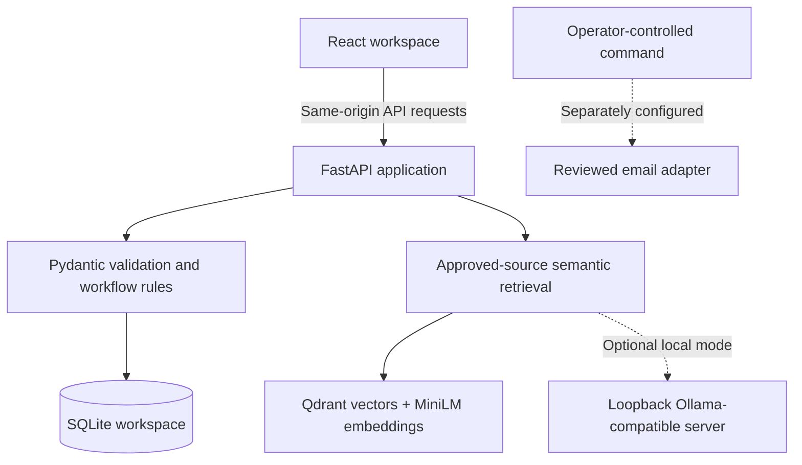

# TMP Accounting Workbench

An accounting operations prototype developed by **Rachit Raj for TMP**. It brings client onboarding, job budgets, staff time, reconciliation review, invoices, reminder preparation, and source-based knowledge lookup into one workspace.

The project prioritizes CRM workflows and operational reliability, followed by accounting automation and a private knowledge assistant. It provides a working foundation for evaluating these workflows before integrating them with TMP’s existing systems.

**Current stage:** deployed standalone prototype with synthetic data. It does not contain or complete TMP’s existing CRM, connect to live bank accounts, execute payments, or provide a trained tax model.

[Live application](https://rachit-accounting-workbench.onrender.com) · [Source code](https://github.com/rachitr200/accounting-workbench) · [Health endpoint](https://rachit-accounting-workbench.onrender.com/api/health)

## Project objectives

- Reduce repeated administrative work across client onboarding, follow-ups, and accounting operations.
- Make outstanding documents, transaction exceptions, duplicate invoices, and budget overruns visible.
- Keep consequential decisions under staff review.
- Support repeatable procedures, staff training, and measurable pilot outcomes.
- Establish a foundation for integrating approved knowledge sources and privately hosted AI.

## Features

| Module | Implemented functionality | Current boundary |
| --- | --- | --- |
| Overview | Outstanding-document counts, transaction review queue, overdue receivables, and job capacity | Calculated from the workspace’s sample records |
| Clients & leads | Create clients, track Lead → Onboarding → Active, manage document checklists | Tracks receipt status; does not upload, store, or inspect documents |
| Jobs & time | Create budgeted jobs, record staff time by date, calculate remaining hours and overruns | No payroll, billing, or timesheet approval integration |
| Reconciliation | Import bank and ledger CSVs, propose matches, identify ambiguous candidates, approve and reverse matches | Review workflow only; no bank connection or posting to a general ledger |
| Accounts payable | Record bills, detect possible duplicates by supplier and reference, approve or reject records | Approval does not initiate payment |
| Accounts receivable | Track open invoices, identify overdue items, prepare reminders | No live settlement, partial-payment allocation, or credit-note handling |
| Reminder drafts | Individual and batch draft creation, same-day duplicate prevention, explicit review | Browser actions never send email |
| Knowledge desk | Semantic search with MiniLM embeddings, Qdrant vector storage, country/year filtering, and cited local or cloud RAG drafts | Sources are synthetic or user-supplied; no authoritative tax corpus is bundled |
| Activity & export | Record workflow changes and export a JSON snapshot | Not an immutable audit system or a backup/restore service |
| Rollout & impact | Save acceptance-check evidence and before/after timing observations | Verification and measurements are entered by users, not independently certified |
| Staff playbook | Step-by-step procedures, failure recovery, reusable prompts, and integration handover guidance | Procedures must be adapted and approved for TMP’s actual processes |

## How the application works

### 1. Client onboarding

1. Create a lead with its service and contact details.
2. Move the client into onboarding and review its document checklist.
3. Prepare a reminder for outstanding documents.
4. Mark documents received after staff confirmation.
5. Activate the client once all required checklist items are complete.

Activation is blocked when required documents remain outstanding. Marking a required document missing returns an active client to onboarding.

### 2. Job allocation and time budgets

1. Create a job linked to a client and set its budget in minutes.
2. Record staff time against that job, including the work date and notes.
3. Compare total recorded time with the budget.
4. Review overruns and remaining capacity on the dashboard.

Time uses integer minutes. The application validates positive durations and limits each entry to 24 hours; this is not a daily cross-job scheduling or payroll system.

### 3. Reconciliation review

1. Import bank transactions and ledger entries using the supplied CSV structure.
2. The backend identifies candidates with equal signed amounts, matching currencies, and dates within three days.
3. Matching references rank candidates ahead of candidates requiring additional review.
4. A staff member checks the records and explicitly approves a match.
5. A ledger entry can be matched only once; an approval can be reversed.

For example, a sample CAD 2,400 bank receipt and matching ledger receipt may be proposed together. Multiple equal-value candidates remain a review decision. Equal amounts alone do not establish a correct match.

Money is stored as integer cents. Imports are transactional: identical repeated IDs are skipped, while an ID with conflicting data rejects the batch. Foreign-exchange conversion, partial matches, multiple bank accounts, and one-to-many matching remain future work.

### 4. Invoice review and follow-ups

1. Record a payable or receivable with its reference, amount, currency, and due date.
2. Review possible duplicate payables before approval.
3. Identify overdue receivables and prepare reminder drafts.
4. Verify recipients and wording before marking drafts reviewed.

The batch follow-up workflow prepares onboarding and overdue-invoice drafts without creating duplicates for the same item on the same day. It does not schedule or send messages automatically. Reconciliation approval does not automatically settle invoices.

### 5. Knowledge lookup and optional AI drafting

1. Add approved source text with its title, jurisdiction, year, and optional source URL.
2. Ask a question for a selected jurisdiction and year.
3. Approved source text is split into overlapping passages, embedded with MiniLM, and stored in an embedded Qdrant vector database per workspace.
4. Semantic search retrieves the four closest eligible passages above the similarity threshold. Country and year filters apply before retrieval; keyword search remains an explicit alternative.
5. Without AI generation selected, the application displays passages with their references and similarity scores.
6. The configured local or Ollama Cloud model can draft an answer grounded in those passages, with citation checks and accountant review.

The application abstains when no eligible source matches. Model-generated drafts must contain valid retrieved-source identifiers; invalid citation identifiers cause the draft to be withheld. This check does not prove factual accuracy or that a cited source supports every claim.

The bundled source is a fictional onboarding procedure. A production tax assistant needs a maintained Canadian/U.S. source collection, effective-date handling, stronger retrieval, and expert evaluation. The Docker image includes a CPU embedding model; no tax-trained model or tax-law corpus is bundled. Cloud generation is an explicit configured connection, not a silent fallback.

### 6. Rollout and impact tracking

The rollout checklist starts with the existing CRM, then onboarding, job budgets, reminders, reconciliation, invoices, knowledge support, and staff handover. A check cannot be marked verified without recorded evidence.

Pilot measurements use:

```text
Weekly time reduction = (before minutes per run − after minutes per run) × runs per week
```

Include review and correction time in observations. Negative results are preserved when the new workflow takes longer. These calculations describe user-entered timing observations, not automatically measured savings or financial return on investment.

## Architecture



| Layer | Technology and responsibility |
| --- | --- |
| Frontend | React 18, Vite, CSS, and Lucide icons |
| API | FastAPI routes for workspace operations |
| Validation | Pydantic schemas plus workflow checks |
| Storage | SQLite for clients, jobs, time, invoices, matches, drafts, sources, activity, and rollout records |
| AI adapter | Optional loopback connection to an installed Ollama-compatible model |
| Packaging | Multi-stage Docker build using Node 22 and Python 3.12 |
| Hosting | Render web service serving both frontend assets and API |
| Checks | Pytest workflow tests and a frontend build through GitHub Actions |

Core financial checks are deterministic code. An LLM does not calculate balances, approve matches, initiate payments, or modify records. Generative AI is optional and limited to drafting knowledge answers.

## Repository structure

```text
backend/
  main.py                  API, database, validation, and model adapter
  send_reviewed.py         Operator-controlled SMTP sender
  requirements-lock.txt    Pinned Python dependencies
  .env.example             Configuration reference; not loaded automatically
frontend/
  src/App.jsx              Main workspace and accounting workflows
  src/Enablement.jsx       Rollout, impact tracking, and staff playbook
  src/style.css            Application styling
  dist/                    Compiled frontend
examples/                  Synthetic bank and ledger CSVs
tests/                     Workflow and public-session tests
.github/workflows/         Automated checks
Dockerfile                 Combined frontend/backend image
render.yaml                Public demonstration deployment
start.command              macOS local launcher
```

## Run locally

Use Python 3.12 and Node 22 to match the container and automated-check environments. The compiled frontend is included; Node is needed when rebuilding it. Initial dependency installation requires internet access.

```sh
git clone https://github.com/rachitr200/accounting-workbench.git
cd accounting-workbench
python3 -m venv .venv
.venv/bin/python -m pip install -r backend/requirements-lock.txt
.venv/bin/python -m uvicorn backend.main:app --host 127.0.0.1 --port 8765
```

Open `http://127.0.0.1:8765`. On macOS, `start.command` is also available. Local records are stored in `data/workbench.sqlite3` and persist across restarts. Keep local mode bound to localhost.

To develop the frontend, keep the backend running and use another terminal:

```sh
cd frontend
npm ci
npm run dev
```

Vite proxies `/api` requests to the backend on port 8765. Rebuild the packaged frontend with:

```sh
npm --prefix frontend run build
```

### Import format

Use Reconciliation → Import CSV with `examples/bank.csv` and `examples/ledger.csv`.

```csv
id,description,reference,amount_cents,currency,txn_date
sample-001,Sample receipt,INV-001,125000,CAD,2026-10-01
```

Use integer cents, CAD or USD, and ISO dates. Negative amounts represent outflows. Keep each dataset to one account and one consistent sign convention. The interface accepts up to 1,000 rows and 1 MB per import.

## Configuration

Export settings into the process environment or configure them through the hosting provider. `.env.example` is documentation, not an automatically loaded file.

| Variable | Purpose |
| --- | --- |
| `PUBLIC_DEMO` | Set to `true` for isolated temporary browser workspaces; otherwise use localhost-only operation |
| `SESSION_SECRET` | Required in public mode; at least 32 characters; keep out of source control |
| `WORKBENCH_DB` | SQLite path; defaults to `data/workbench.sqlite3` |
| `WORKBENCH_ALLOWED_HOSTS` | Additional permitted hostnames, comma-separated; not an authentication control |
| `PORT` | Container listening port; defaults to `10000` |
| `OLLAMA_MODEL` | Exact name of an already-installed local model |
| `OLLAMA_URL` | Supported values: `http://127.0.0.1:11434` or `http://localhost:11434` |
| `SMTP_ENABLED` | Explicitly set `true` only when configuring authorized operator-controlled sending |
| `SMTP_HOST`, `SMTP_PORT` | Mail server and TLS port, 465 or 587 |
| `SMTP_FROM`, `SMTP_USERNAME`, `SMTP_PASSWORD` | Approved sender and mail-service credentials |

Render’s external hostname is added to the allowed-host list automatically.

### Optional local model

Install and run an appropriate model in a local Ollama-compatible server, then launch the application with:

```sh
export OLLAMA_MODEL='your-installed-model-name'
.venv/bin/python -m uvicorn backend.main:app --host 127.0.0.1 --port 8765
```

Choose **Draft an answer with AI using retrieved sources** in Knowledge desk. Public-demo mode enables generation only with the configured Ollama Cloud adapter. Local generation remains available for local deployments. In a Docker container, loopback refers to that container; the existing adapter will not connect to a separate model container or remote host without implementation changes. Model selection, licence review, hardware sizing, and live-model evaluation are still required.

### Optional reviewed email delivery

The standalone adapter lists eligible reviewed drafts without contacting a mail server:

```sh
.venv/bin/python -m backend.send_reviewed
```

Sending a particular draft requires explicit configuration and an explicit command:

```sh
.venv/bin/python -m backend.send_reviewed --id <draft-id> --send
```

The adapter rejects sample/reserved recipient domains, uses TLS, claims the draft before sending, and holds uncertain outcomes for manual review. It targets the configured local database, not a public visitor’s workspace. SMTP acceptance is not proof of delivery. No live provider was exercised in the current verification.

## Deployment for TMP

### Current public demonstration

The included Render Blueprint creates one free Docker web service. It builds React and serves the compiled frontend through FastAPI, so the frontend and backend use the same HTTPS origin without a separate public API URL.

1. Connect this repository to Render and create a Blueprint from `render.yaml`.
2. Keep `PUBLIC_DEMO=true`; the Blueprint generates `SESSION_SECRET`.
3. Deploy and check `/api/health`.
4. Open the application and exercise the sample workflows.

Public mode uses signed, secure, HTTP-only session cookies, separate temporary SQLite workspaces, request throttling, origin checks, host restrictions, and browser security headers. These controls support a sample-data demonstration; they are not staff login, role-based authorization, or production client isolation.

The free deployment has temporary storage and may sleep when idle. Sample records can reset after a restart or redeploy. Use fictional data only.

### TMP evaluation environment

The current project can be evaluated on an individual workstation or in a restricted staging environment using synthetic records. The Docker image is portable, but no TMP cloud account, internal network, identity provider, or production infrastructure has been configured by this repository.

A local container evaluation can use:

```sh
docker build -t tmp-accounting-workbench .
docker run --rm -p 127.0.0.1:10000:10000 tmp-accounting-workbench
```

This example deliberately uses disposable storage and localhost access. It is not a production deployment command. For a shared staging environment, establish approved network access and identity controls first, use HTTPS, configure the exact hostname, and continue using synthetic data.

### Integration with TMP’s existing CRM

Begin with the existing system rather than assuming this prototype should replace it:

1. Review the CRM codebase, stack, deployment process, unfinished features, defects, and data model.
2. Agree on acceptance criteria for onboarding, leads, automated correspondence, job allocation, and time budgets.
3. Decide which components belong in the existing CRM and which should remain a separate service.
4. Map clients, jobs, invoices, and staff identifiers; define the system of record for each entity.
5. Implement authenticated interfaces, migrations, duplicate prevention, and monitored background jobs.
6. Validate end-to-end workflows with process owners before a staged rollout.

The API in this prototype is not yet a production integration contract. Zapier, Make, n8n, accounting software, and email-provider integrations are not active.

### Requirements before production client data

| Area | Required implementation |
| --- | --- |
| Identity and access | TMP-approved sign-in/SSO, staff roles, least-privilege permissions, and enforceable client-level access |
| Data storage | Production database design, schema migrations, encrypted storage, retention controls, and tested backup/restore |
| Infrastructure | Approved hosting region, TLS, managed secrets, restricted network access, dependency maintenance, and monitoring |
| Background operations | Durable job queue, retries with duplicate protection, failure alerts, and clear ownership |
| Documents | Secure upload/storage, malware scanning, access checks, and retention policy |
| Auditability | Actor-attributed events, protected audit retention, and review procedures |
| Release process | Separate staging/production, acceptance tests, rollback plan, and staff sign-off |
| Knowledge service | Approved source ingestion, provenance, model evaluation, access filtering, and accountant review |

Changing the hostname or setting `PUBLIC_DEMO=false` does not supply these capabilities. A production database such as PostgreSQL would require code and migration work; it is not a configuration-only switch in the current SQLite implementation.

## Development roadmap

### Priority 1 — Complete the CRM workflows

- Audit TMP’s existing CRM and convert remaining work into an agreed feature and defect backlog.
- Integrate client onboarding, lead tracking, staff allocation, time approval, and budget reporting with its actual records.
- Add authenticated access, database migrations, regression coverage, and a repeatable release process.
- Connect the approved email provider, with templates, scheduling, review policies, delivery tracking, and duplicate protection.

**Completion evidence:** process owners can complete the agreed workflows in staging, critical defects are resolved, and rollback and support procedures are tested.

### Priority 2 — Connect accounting operations

- Add approved bank/accounting-system interfaces and explicit account identifiers.
- Extend matching to partial payments, one-to-many transactions, and documented exception handling.
- Add invoice aging, settlement, partial-payment allocation, and credit notes.
- Keep posting and payment actions behind defined approval rules and access controls.

**Completion evidence:** representative records reconcile with the source systems, exceptions remain visible, and duplicate execution does not create duplicate financial actions.

### Priority 3 — Build the private knowledge assistant

- Benchmark suitable open-weight models against TMP-reviewed questions and deployment constraints.
- Build a permitted, versioned Canadian/U.S. source collection with provenance and update ownership.
- Add document parsing, stronger retrieval, jurisdiction-specific filters, effective dates, and superseded-source handling.
- Evaluate factual support, citation accuracy, abstention, access isolation, latency, and running cost.
- Pilot with staff before considering a client-facing portal.

**Completion evidence:** an accountant-reviewed evaluation set meets agreed thresholds and unsupported or conflicting questions are handled safely. Fine-tuning should follow an identified evaluation need; it is not a substitute for current, retrievable sources.

### Priority 4 — Improve adoption and measurable outcomes

- Adapt the playbook into approved SOPs and short practical training sessions.
- Assign workflow owners, support coverage, and manual fallbacks.
- Measure completion rates, error/rework rates, staff adoption, time spent, and operating cost.
- Version prompts and evaluate tool changes before adoption.
- Expand into client-service and marketing workflows after core CRM and accounting priorities are stable.

**Completion evidence:** staff can use the workflows independently, support ownership is clear, and measured outcomes justify continued use.

## Testing and verification

```sh
.venv/bin/python -m pytest tests -q
npm --prefix frontend run build
```

The current suite contains 36 passing tests covering onboarding gates, draft deduplication, duplicate payables, matching constraints, atomic imports, integer-value validation, time limits, source filtering, mocked model responses, persistence, mocked SMTP behavior, separate public sessions, throttling, rollout evidence, and pilot measurement validation. GitHub Actions runs the tests and frontend build.

Live checks have confirmed frontend/API connectivity, saved sample records, separate visitor workspaces, and saved impact calculations. These checks do not establish compatibility with TMP’s CRM, production security, tax-answer accuracy, or performance at scale. A live Ollama Cloud workflow investigation and review-recording round trip was verified on October 5, 2026 using synthetic records. Live email delivery, bank connections, and payment integrations have not been validated.

## Related projects

- [ACTO SuperAgent](https://github.com/rachitr200/acto-superagent): React/FastAPI structure and structured-response patterns.
- [Freight Bidding Agent](https://github.com/rachitr200/freight-bidding-agent): staged workflow, validation, and activity-tracking patterns.

Accounting Workbench adds accounting-specific interfaces, SQLite persistence, review rules, imports, and tests. Its current workflows use deterministic operations and an optional model adapter; it does not use LangGraph.


## Connected operations workflow

Open **Workflow centre** and run the operations workflow. One database transaction prepares onboarding and overdue-invoice reminder drafts, checks exhausted job budgets, identifies possible duplicate payables, and collects unmatched bank transactions for review. The output includes ordered steps, counts, an exception list, and saved run history. All external actions remain pending staff review.

`POST /api/workflows/operations` accepts `{"run_key":"operations:2026-10-05"}`. Repeating the same key returns the saved result without executing again. Use a new key after input changes; draft-level same-day duplicate prevention still applies. Any failure rolls back the entire transaction so the key can be retried. Run results are snapshots, not live task completion status. This endpoint uses deterministic rules; no AI model is invoked.

### n8n template

Import `integrations/n8n/tmp-operations.json` using n8n’s file-import option. This is a **manual, local evaluation template**, not an activated or tested n8n service connection.

1. Run the workbench locally on port 8765 with synthetic data.
2. Run n8n on the same host outside a container so the template’s loopback URL reaches the workbench.
3. Import the JSON and execute Manual start. The HTTP node returns drafts prepared, review items, and the run ID.
4. Inspect results in Workflow centre and review drafts in Reminder drafts.
5. Reuse a run key when retrying the same logical event; the template uses the n8n execution ID. A new execution receives a new run key.

An n8n Cloud instance or a separate container cannot reach the host application through its own loopback address. Do not expose local mode to the internet to work around this. Shared or scheduled operation requires an authenticated service interface, persistent workspace, approved network configuration, failure handling and support ownership. The public Render demo uses visitor cookies and is not the target for this template.

After those integration requirements are implemented, a schedule or approved incoming event can replace the manual trigger. The next AI stages are document extraction and email classification into validated proposals, followed by human review. They are not implemented by this template. No email, payment or accounting posting is performed.


## Three-stage AI-assisted review

1. **Automation:** Workflow centre runs deterministic checks, prepares reminder drafts and saves the exception snapshot.
2. **Agent investigation:** On a private local installation with `OLLAMA_MODEL` configured, select **Investigate with AI**. The model chooses among read-only client, job, invoice and reconciliation tools. It has at most five model steps, sees bounded workspace records, and must reference evidence it inspected. There is no code execution, network-browsing tool or write tool.
3. **Accountant decision:** Review the proposal and evidence, then approve or reject with a reviewer label and notes. Approval is refused when underlying accounting records have changed. Approval records a decision only; it does not send email, post entries or make payments. Actual actions still use the existing review screens and separately configured integrations.

This is a bounded agent loop, not an autonomous accountant. Retrieved references are checked for membership, not semantic truth. Reviewer labels are not authenticated identities. Production use needs real roles, evidence evaluation and operational recovery. A failed model response is recorded as Failed and can be retried; a process crash can leave a Running record that requires operator recovery. Public deployments support an optional server-side Ollama Cloud connection for workflow investigation. Local model weights and runtime are installed separately and are not included in the repository.


### Optional cloud AI for online visitors

The workflow investigation can use Ollama Cloud without running a model on the web server. Set these **server environment variables** in Render:

- `AI_PROVIDER=ollama-cloud`
- `OLLAMA_MODEL`: a model name currently available from Ollama Cloud's `/api/tags` endpoint.
- `OLLAMA_API_KEY`: your secret Ollama API key, entered directly in Render; never commit it or put it in frontend settings.
- `AI_DAILY_REVIEW_LIMIT=20`: shared maximum investigation attempts per day.
- `AI_VISITOR_DAILY_LIMIT=3`: maximum attempts per visitor workspace per day.

Visitors do not need a provider account. Your provider account supplies the usage quota and any charges. Each investigation has at most five model calls, each with a bounded response. The AI only reads records and proposes actions; review never sends emails or payments. This cloud option applies to Workflow centre and Knowledge desk. RAG drafts share the same global and visitor daily allowance as investigations; semantic search without generation does not consume cloud-model quota.

Use synthetic data on the public prototype. Workflow records are sent to Ollama Cloud after the visitor starts an investigation. Cloud output is validated locally against a strict schema and evidence IDs; factual accuracy still needs human review. Failed attempts count against the allowance. A new browser session can bypass the visitor limit, but all sessions share the global limit. SQLite counters survive application restarts only with persistent storage; Render's ephemeral free storage can reset on redeployment. Configure provider-side quotas as well. For a production deployment, use durable quota storage and authenticated users.

A live investigation using `gemma4:31b` on Ollama Cloud was verified on October 5, 2026: the agent read reconciliation and invoice evidence, saved a proposal, and recorded a test rejection with `executed=false`. Automated tests use simulated provider responses. This connectivity check does not establish accounting accuracy; matching amounts alone do not establish payment settlement or justify deleting an apparent duplicate.


## Semantic retrieval and RAG

**Flow:** approved text → 850-character passages with 120-character overlap → MiniLM 384-dimensional embeddings → Qdrant cosine search → country/year filtering → up to four passages → model answer with references → accountant review.

- Knowledge desk defaults to semantic search. A synonym question such as “What paperwork should a new customer supply?” retrieves the sample onboarding document without requiring exact keyword overlap.
- **Build / update vector index** explicitly synchronizes the library. Searches also synchronize automatically after changes. Content fingerprints include all source fields; editing or revoking a source invalidates the index revision. Retrieval rechecks returned points against the SQLite source records.
- Each signed visitor workspace has its own disk-backed Qdrant directory alongside its SQLite database. No shared collection mixes visitors. Index directories are removed when expired demo workspaces are cleaned up.
- Embeddings run on the app server using `sentence-transformers/all-MiniLM-L6-v2` via FastEmbed/ONNX, with one CPU thread. Document text is not sent to an external embedding service. Cloud generation sends the question and retrieved passages to the configured Ollama account.
- Results expose source and passage IDs, excerpts, offsets, country, tax year and cosine similarity. A score measures semantic similarity, not truth or tax correctness. A configurable retrieval pipeline is not equivalent to a tax-trained LLM.
- Source ingestion currently accepts pasted text through the source library; automatic PDF parsing, OCR, website crawling and maintained CRA/IRS ingestion are future work.

The prototype limits each workspace to 40 approved sources and 1,200 passages, retrieving at most four above a 0.35 cosine score. This is an initial threshold, not a validated tax-domain acceptance threshold. Review source coverage and evaluate it with TMP accountants before production use. Citation validation checks identifier membership; it does not prove that every claim is supported. Unsupported queries can still retrieve a superficially similar passage, so inspect evidence and abstention behavior.

Qdrant runs in embedded local mode, suitable for this small single-process prototype. The app serializes vector operations to avoid simultaneous writers. Use one web worker. Large collections and multiple application replicas require Qdrant server/cloud plus enforced tenant filters, authenticated roles, durable ingestion jobs and a migration plan; those are not configured here.

The Docker build downloads the embedding model into `/app/models` and runtime loads it offline (`RAG_OFFLINE=true`). Local runs download model weights once into the FastEmbed cache; set `FASTEMBED_CACHE_PATH` to customize the cache directory. Python 3.10 or newer is required by the embedding dependencies; Python 3.12 is used in Docker and CI. The free Render instance uses ephemeral storage: sources and vectors may reset on deployment, and cold starts can delay loading. Production needs persistent storage and backups. Model/cache files and vector databases are excluded from GitHub.

Tests cover real MiniLM semantic retrieval, Qdrant persistence, country/year and approval filters, source revision/revocation, separate visitor indexes, cloud-context construction and invalid-citation withholding. These checks establish pipeline behavior, not the correctness of Canadian or U.S. tax advice.
